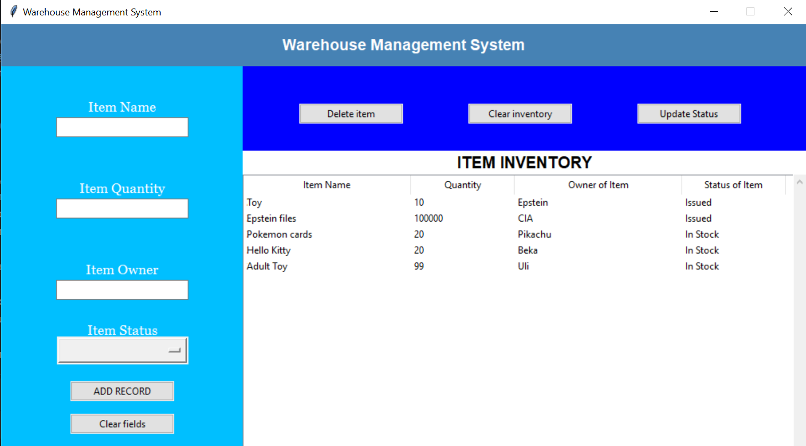

📦 Warehouse Management System (Python + PostgreSQL)

A desktop-based Warehouse Management System built with Python (Tkinter) and PostgreSQL.
This application provides a simple graphical interface to manage warehouse inventory, allowing users to add, view, update, and delete items stored in a PostgreSQL database.

🚀 Features

📋 View all inventory items in a table (TreeView)

➕ Add new items to the warehouse

🗑️ Delete a selected item

🧹 Clear the entire inventory

🔄 Update item status (e.g., In Stock → Issued)

🧾 Store inventory data persistently using PostgreSQL

🖥️ User-friendly GUI built with Tkinter

🛠️ Technologies Used

Python 3

Tkinter – GUI framework

PostgreSQL – Relational database

psycopg2 – PostgreSQL database adapter for Python

🗄️ Database Structure
Diagram:
.png)
Tables:
customers
sectors
item

Relationships:
item.fk_owner_id → customers.id
item.fk_sector_id → sectors.id

✅ SQL: Create Database Schema
1️⃣ (Optional) Create Database
CREATE DATABASE warehouse;

\c warehouse;

2️⃣ Customers Table
CREATE TABLE customers (
    id SERIAL PRIMARY KEY,
    name VARCHAR(100) NOT NULL,
    address VARCHAR(100),
    phone VARCHAR(100)
);

3️⃣ Sectors Table
CREATE TABLE sectors (
    id SERIAL PRIMARY KEY,
    name VARCHAR(1) NOT NULL
);

⚠️ VARCHAR(1) matches the diagram exactly (sector names like A, B, C)

4️⃣ Item Table
CREATE TABLE item (
    id SERIAL PRIMARY KEY,
    name VARCHAR(100) NOT NULL,
    quantity INTEGER NOT NULL CHECK (quantity >= 0),
    item_status VARCHAR(20),

    fk_owner_id INTEGER NOT NULL,
    fk_sector_id INTEGER NOT NULL,

    CONSTRAINT fk_item_owner
        FOREIGN KEY (fk_owner_id)
        REFERENCES customers(id)
        ON DELETE CASCADE,

    CONSTRAINT fk_item_sector
        FOREIGN KEY (fk_sector_id)
        REFERENCES sectors(id)
        ON DELETE CASCADE
);

🔗 ER Relationship Summary
customers (1) ────< item >──── (1) sectors

One customer → many items
One sector → many items
Each item belongs to one customer and one sector

🧪 Example Inserts (Optional)
INSERT INTO customers (name, address, phone)
VALUES ('John Doe', 'Main Street 12', '555-1234');

INSERT INTO sectors (name)
VALUES ('A'), ('B'), ('C');

INSERT INTO item (name, quantity, item_status, fk_owner_id, fk_sector_id)
VALUES ('Laptop', 10, 'In Stock', 1, 1);

✅ Normalization Check

1NF: Atomic values ✔

2NF: No partial dependency ✔

3NF: No transitive dependency ✔

⚙️ How It Works

The application establishes a connection to a local PostgreSQL database using psycopg2.

Inventory records are retrieved and displayed in a TreeView widget.

Users can:

Insert new items using input fields

Remove selected items

Update item status

Clear all inventory data

All changes are committed directly to the database.

▶️ Running the Project
Prerequisites

Python 3 installed

PostgreSQL installed and running

psycopg2 library installed:

pip install psycopg2

Steps

Create the warehouse database and item table in PostgreSQL.

Update database credentials in the code if needed:

psycopg2.connect(
    host="localhost",
    database="warehouse",
    user="postgres",
    password="your_password",
    port="5432"
)

Run the application:

python main.py

🖼️ User Interface Overview

Here is how the GUI looks:

Left Panel: Add new inventory items

Top Right Panel: Delete items, clear inventory, update status

Bottom Right Panel: Inventory table with scrollbars
